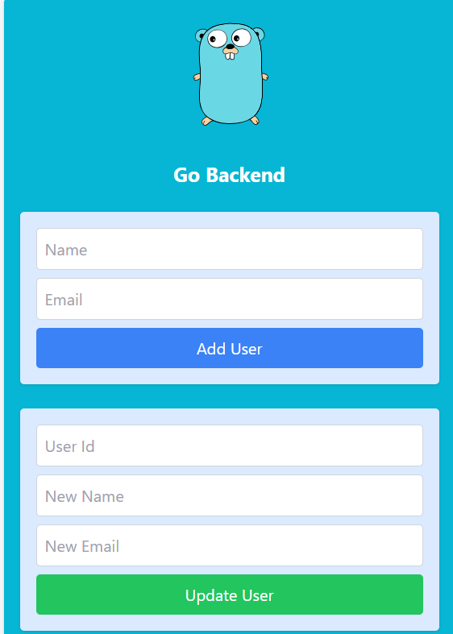

# Go + Next.js User Management Application

This project is a full-stack application using Go for the backend API and Next.js for the frontend. It demonstrates basic CRUD operations for user management.

## Prerequisites

- Docker
- Docker Compose

## Project Structure

- `backend/`: Contains the Go API
- `frontend/`: Contains the Next.js frontend application

## Setup and Running the Application

1. Clone the repository:
   ```
   git clone <repository-url>
   cd <project-directory>
   ```

2. Build and start the containers:
   ```
   docker-compose up -d --build
   ```

   This command will:
   - Build the Go backend image
   - Build the Next.js frontend image
   - Pull the PostgreSQL image
   - Start all services defined in the docker-compose.yml file

3. The services will be available at:
   - Frontend: http://localhost:3000
   - Backend API: http://localhost:8000
   - PostgreSQL: localhost:5432 (accessible from within the Docker network)

4. To stop the application:
   ```
   docker-compose down
   ```

## API Endpoints

- GET /api/go/users: Fetch all users
- POST /api/go/users: Create a new user
- GET /api/go/users/{id}: Fetch a specific user
- PUT /api/go/users/{id}: Update a user
- DELETE /api/go/users/{id}: Delete a user

## Development

To make changes to the application:

1. Backend (Go):
   - Modify the files in the `backend/` directory
   - Rebuild the Docker container: `docker-compose up --build goapp`

2. Frontend (Next.js):
   - Modify the files in the `frontend/` directory
   - Rebuild the Docker container: `docker-compose up --build nextapp`

## Troubleshooting

- If you encounter any issues with database connections, ensure that the `DATABASE_URL` in the `.env` file matches your Docker Compose configuration.
- For any "connection refused" errors, make sure all containers are running: `docker-compose ps`

## Contributing

Please read CONTRIBUTING.md for details on our code of conduct, and the process for submitting pull requests.

## License

This project is licensed under the MIT License - see the LICENSE.md file for details.

## Preview



## Database Connection

The Go backend is configured to connect to the PostgreSQL database using the following connection string:
